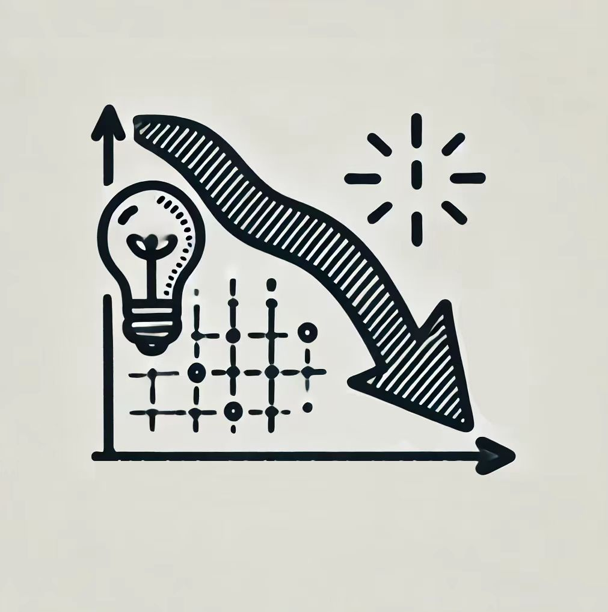

# AI Track

天天被 AI “三大顶刊”刷屏？大火的“人工智能”究竟是什么？AI 到底是什么原理？我们可以如何入手？如果对这些问题充满好奇，想揭开“神经网络”、“深度学习”、“计算机视觉”等等耳熟能详的话语背后的神秘面纱，那就速速加入人工智能板块的学习吧！在这里，经验丰富的学长会手把手教学，带领你一窥人工智能的奥秘，领略计算机世界的无限精彩！

通过 AI Track 的学习，你将能够：

- 学习利用 Python 进行**数据分析**，学会应用 **NumPy**(数据计算)、 **Matplotlib**(数据可视化) 库
- 了解人工智能领域的核心：**机器学习**，了解什么是模型，学习训练一个模型所用的**核心算法**
- 进行数据**应用实战**，用获取的数据真正训练一个模型
- 了解当下人工智能的热门方向：**自然语言处理**与**计算机视觉**

## 🤔 8月3日 神经网络

>本课程将介绍机器学习中的著名算法神经网络模型。课程将主要介绍：神经网络的概念及其适用问题、机器学习任务的简单介绍、神经网络的组成、神经网络的学习算法、信息结构与神经网络结构、神经网络的常见任务与神经网络的设计。通过本课程的学习，同学应当能够了解神经网络算法的概念，知晓神经网络算法的适用问题，了解神经网络如何优化，并且知晓一部分经典的神经网络结构。

🎓 讲师：王思图

### 课程讲义

[神经网络 课程讲义](https://summer24.net9.org/ai/neural-network/network/)

### 课程回放

[神经网络 课程讲义](https://www.bilibili.com/video/BV11SvDeNEbY/?share_source=copy_web&vd_source=5f41358f46c6dc60e03c3ff6ca5a8520)

## 💡 8月6日 机器学习中的优化方法

>如果用几个字概括 AI 模型的训练过程，大概就是“最小化损失函数”。在高维空间中，寻找一个函数的最小值点（甚至只是局部最小值）并非易事，而“优化”正是研究这类问题的数学分支。我们都已熟悉反向传播和梯度下降法，也亲眼见证了这样简单的优化方法所赋予模型的神奇魔力。但是，是否有可能从理论的角度给出某类优化算法的复杂度保证呢？ 
>
>在本课程中，我们将： 
>
>1. 介绍机器学习中常用的优化方法，包括梯度下降法、随机梯度下降法、条件梯度法等； 
>2. 在一定的假设下（如损失函数满足凸性/非凸/光滑/利普希茨连续等），研究优化算法收敛性与复杂度的理论保证；
>3. 简要介绍复杂度下界的证明方法； 
>4. 如有可能，还将简要介绍一些 advanced topics，如方差缩减技术、Nesterov 加速梯度下降法等。 
>
>希望同学们能通过本课程了解一些经典的一阶优化算法及复杂度分析方法，并能对优化这一领域建立一些最基本的认识。本课程应基本不会涉及代码编写。如果愿意的话，可以在身旁准备一支铅笔和几张草稿纸~

🎓 讲师：张华清

### 课程讲义

[机器学习中的优化方法 课程讲义](https://github.com/sast-summer-training-2024/sast2024-optimization/blob/db76dd97daed72c1dc69d1ce236ae0631ea59e01/%E6%9C%BA%E5%99%A8%E5%AD%A6%E4%B9%A0%E4%B8%AD%E7%9A%84%E4%BC%98%E5%8C%96%E6%96%B9%E6%B3%95_slides.pdf)

### 课程回放

[机器学习中的优化方法 课程回放](https://www.bilibili.com/video/BV1oNakeHEzo/?share_source=copy_web&vd_source=5f41358f46c6dc60e03c3ff6ca5a8520)

## 🧰 8月9日 Python数据处理与可视化基础与PyTorch

>本次课程主要介绍python中的三个常用库：Numpy，Matplotlib.pyplot，PyTorch，同时会简要介绍 SciPy 库的部分功能。经过本课程的学习，同学应当能够了解如何使用 Numpy 进行数据处理和线性代数操作，并使用 Matplotlib 进行数据的可视化以及在 SciPy 库辅助下进行简单数据分析。此外，还应该掌握如何使用 PyTorch 实现一个完整的神经网络训练流程。本课程的 PyTorch 部分要求先修神经网络课程。本课程对《人工智能导论》课程的大作业开发有帮助。

🎓 讲师：王思图

### 课程讲义

[数据处理与可视化基础与PyTorch 课程讲义](https://summer24.net9.org/ai/dp-and-pytorch/readme/)

### 课程回放

[数据处理与可视化基础与PyTorch 课程回放](https://www.bilibili.com/video/BV1FSYueTEWw/?share_source=copy_web&vd_source=5f41358f46c6dc60e03c3ff6ca5a8520)