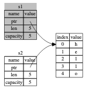

# Rust讲义

声明：本讲义很大程度参考或者在个别位置直接复制了官方文档。

按照Rust官网阐述的Rust的优势有三：性能、可靠、高产。Rust：

- 与 C/C++ 相比：Rust有可以一较高下的性能，但是却比 C/C++ 更加现代化，没有沉重的历史包袱，有各种现代化的语言特性和项目和依赖管理系统，并且有
  Rust 独特的可靠性保证。
- 与 Python/JS 相比：Rust同样有一个活跃的生态，并且也有现代化的语言设计，同时也有动态语言绝对无法企及的性能优势。
- 与 Java/C# 相比：Rust有更好的性能和项目管理，同时也有更好的可靠性保证。

除了各种现代化理念和设计之外，我认为Rust最核心的竞争力其实在于其所有权系统。所有权系统是Rust的核心特性之一，也是Rust的灵魂所在。所有权系统是Rust的一种内存管理方式，它是一种在编译时检查内存安全的方式，它可以保证内存安全，避免内存泄漏、空指针、数据竞争等问题。所有权系统的出现联合其他一些设计保证了
Rust 可以很轻松地实现多线程并发。

学习一门语言，我认为最核心的不是了解这个语言一些基础的语法，而是理解其设计理念。Rust的基本语法和别的语言没有什么太大区别，变量、赋值、运算、控制流，这些与大家熟知的
C++/Python 都是大同小异的。我们不妨先来看看Rust的所有权系统。

## 所有权（Ownership）

### 值与内存

一个值的本质是什么呢？相信学过 OOP 的大家一定知道，一个值的本质其实就是存在一片内存上的数据。就像下面这样：

```
| - | - | h | e | l | l | o | 0 | - |
          ^
```

如上所示就是一个字符串。这个字符串就是一个值。那么变量是什么呢？其实就是指向这个值的一个指针，也就是下面那个小尖。这个指针指向这个值的内存地址。

这也就是我们写如下代码时候发生的事情：

```c++
char s[] = "hello";
```

但这里最大的问题其实在于"hello"这个值谁都可以随意的改。比如：

```c++
char *b = s;
b[1] = 'a';
```

那么下次再使用`s`的时候，这个值实际上已经变成`"Hallo"`了。更甚者，假如我通过b释放了这段内存：

```c++
delete[] b;
```

那么`s`就变成了一个悬垂指针。也许在这个简单的例子里一切还都比较清晰，可是当项目一大，很容易忘记哪个值在什么时候给了谁又被谁如何篡改，最终导致自己也搞不清这个值在何时何地应该是何种状况了。

### 值的所有权

Rust 为了解决这一点，提出了所有权的概念。也就是，一个值只能有一个所有者，比如这个"hello"
，他是我的就是我的，是我的就不再能是别人的了。那么我们如果用Rust来做上面的操作是什么样的呢？

```rust
let s1 = String::from("hello");
let s2 = s1;
```

String 是一个对象，包含了一个字符串的一些元信息，最开始是这样的：


然后变成了这样：


这看起来与 C++ 没什么区别，但实际上，这时候所有权已经发生了转移，`s1`所对应的值已经不属于`s1`了，如果我们试图使用`s1`呢？

```rust
let s1 = String::from("hello");
let s2 = s1;

println!("{s1}, world!");
```

你会得到一个类似这样的编译器错误：

```bash
$ cargo run
   Compiling ownership v0.1.0 (file:///projects/ownership)
error[E0382]: borrow of moved value: `s1`
 --> src/main.rs:5:15
  |
2 |     let s1 = String::from("hello");
  |         -- move occurs because `s1` has type `String`, which does not implement the `Copy` trait
3 |     let s2 = s1;
  |              -- value moved here
4 |
5 |     println!("{s1}, world!");
  |               ^^^^ value borrowed here after move
  |
  = note: this error originates in the macro `$crate::format_args_nl` which comes from the expansion of the macro `println` (in Nightly builds, run with -Z macro-backtrace for more info)
help: consider cloning the value if the performance cost is acceptable
  |
3 |     let s2 = s1.clone();
  |                ++++++++

For more information about this error, try `rustc --explain E0382`.
error: could not compile `ownership` (bin "ownership") due to 1 previous error
```

Rust的报错信息可读性是很高的，大家可以尝试阅读一下，可以看到，编译器友善地告诉我们，第三行的位置值已经被移动了，也就是所有权发生转移了，那么此时之后的`s1`
也就不再可用了。所以实际情况应该类似：



别人如果想用，我可以把这个东西直接给他，也就是所有权发生转移，这就有点类似 C++ 里的 move 语义。

### 引用与借用

可是如果我不想给你所有权，我只想让你暂时用一下呢？那么其实我可以暂时借给你，但这个东西本身所有权还是我的，但你可以暂时用一下，这就是借用（Borrowing）。

```rust
let s1 = String::from("hello");
let s2 = &s1;
println!("{s2} from s2!");
let s3 = &s1;
println!("{s3} from s3!");
println!("{s1} from s1!");
```

你看到的输出应该类似：

```text
hello from s2!
hello from s3!
hello from s1!
```

这里的`&`就是Rust里的借用符号，这里的`s2`和`s3`都是`s1`的引用，创建引用的行为就叫借用，他们可以暂时使用`s1`对应的值，但是不可以修改它。

### 函数传参时的所有权系统

不难想到，函数的调用过程里参数的传递其实和赋值是很像的，如果用程设的话来讲，就是把实参的值赋给形参。那么这时候所有权系统该如何处理呢？

其实道理是一样的，请看如下例子：

```rust
fn main() {
    let s = String::from("hello");  // s 进入作用域

    takes_ownership(s);             // s 的值移动到函数里 ...
                                    // ... 所以到这里不再有效
                              
    // println!("{s}"); // 这里会报错

}

fn takes_ownership(some_string: String) { // some_string 进入作用域
    println!("{}", some_string);
} // 这里，some_string 移出作用域并调用 `drop` 方法。
  // 占用的内存被释放

```

在调用 `takes_ownership(s)`的时候，所有权就发生了转移，如果再试图使用`s`，编译器就会报一个和刚才相似的错误。

函数同样也可以产生一个值并且把这个值移动给调用者，比如：

```rust
fn main() {
    let s1 = gives_ownership();         // gives_ownership 将返回值
                                        // 转移给 s1

    let s2 = String::from("hello");     // s2 进入作用域

    let s3 = takes_and_gives_back(s2);  // s2 被移动到
                                        // takes_and_gives_back 中，
                                        // 它也将返回值移给 s3
} // 这里，s3 移出作用域并被丢弃。s2 也移出作用域，但已被移走，
  // 所以什么也不会发生。s1 离开作用域并被丢弃

fn gives_ownership() -> String {             // gives_ownership 会将
                                             // 返回值移动给
                                             // 调用它的函数

    let some_string = String::from("yours"); // some_string 进入作用域。

    some_string                              // 返回 some_string 
                                             // 并移出给调用的函数

}

// takes_and_gives_back 将传入字符串并返回该值
fn takes_and_gives_back(a_string: String) -> String { // a_string 进入作用域

    a_string  // 返回 a_string 并移出给调用的函数
}
```

在Rust里，一个大括号就是一个作用域，所有即将离开自己所属作用域的变量都会理解被析构，作用域结尾不加分号的值代表这个作用域的返回值，这个值会被移动到调用者的作用域里，这里就是函数返回一个值的方式。我们后续会更加详细地介绍作用域的概念。

同样，参数传递的时候，如果我们不想转移所有权，我们也可以借用：

```rust
fn main() {
    let s1 = String::from("hello");

    let len = calculate_length(&s1);

    println!("The length of '{s1}' is {len}.");
}

fn calculate_length(s: &String) -> usize {
    s.len()
}
```

但是注意，一个函数是不能返回函数里产生的值的引用的。

> 思考：这是为什么呢？

答案是函数里的值在离开作用域的时候会被丢弃，这时候返回的值的引用其实是一个悬垂引用，也就是这个调用者拿到这个引用并不能真的引用到任何仍旧存在的值。相信如果你有在
C++ 里试图返回一个栈上变量的引用，那么你应该对此深有体会。

## 作用域

与 C++ 的作用域类似，Rust 的作用域标记了一个或一些变量的有效范围。例如：

```rust
fn main() {
    let s = "hello"; // s 在这里有效

    // 这里是 s 的作用域

} // 这里，s 不再有效
```

作用域可以嵌套：

```rust
fn main() {
    let s1 = "hello";

    { // 这是一个新的作用域

        let s2 = "world"; // s2 在这里有效

    }
    // s2 不再有效，s1 依然有效
}
```

作用域里的变量不会覆盖上一级的变量：

```rust
fn main() {
    let s = "hello";

    {
        let s = "world";
        println!("{s}"); // 这里输出的是world
    }
  
    println!("{s}"); // 这里输出的是hello
}
```

作用域可以有返回值：

```rust
fn main() {
    let s = "hello";

    let s1 = {
        let s2 = "world";
        s2
    };

    println!("{s1}"); // 这里输出的是world
}
```

正如上一节提到，这里`s2`作为作用域的返回值被返回给了`s1`，相应所有权也转移给了`s1`。有了这个特性，我们可以这样写三元表达式：

```rust
fn main() {
    let condition = true;
    let number = if condition { 5 } else { 6 };

    println!("{number}");
}
```

甚至可以这样：

```rust
fn main() {
    let number = 10;
  
    let result = if number % 4 == 0 {
        "number is divisible by 4"
    } else if number % 3 == 0 {
        "number is divisible by 3"
    } else if number % 2 == 0 {
        "number is divisible by 2"
    } else {
        "number is not divisible by 4, 3, or 2"
    };

    println!("{number}");
}
```

所有权与作用域的关系已经在上文阐述了，所有离开作用域的值，除了返回值，都会被析构。

## 变量与可变性

Rust的变量默认是不可变的，这意味着如果你尝试修改一个变量的值，编译器会报错：

```rust
fn main() {
    let x = 5;
    println!("The value of x is: {x}");
    x = 6;
    println!("The value of x is: {x}");
}
```

这段代码会报错：

```bash
$ cargo run
   Compiling variables v0.1.0 (file:///projects/variables)
error[E0384]: cannot assign twice to immutable variable `x`
 --> src/main.rs:4:5
  |
2 |     let x = 5;
  |         -
  |         |
  |         first assignment to `x`
  |         help: consider making this binding mutable: `mut x`
3 |     println!("The value of x is: {x}");
4 |     x = 6;
  |     ^^^^^ cannot assign twice to immutable variable

For more information about this error, try `rustc --explain E0384`.
error: could not compile `variables` (bin "variables") due to 1 previous error
```

如果我们想要一个可变的变量，我们可以使用 `mut`关键字：

```rust
fn main() {
    let mut x = 5;
    println!("The value of x is: {x}");
    x = 6;
    println!("The value of x is: {x}");
}
```

这下程序就可以正常运行了。

### 所有权与可变性

还记得之前对引用与借用的讨论吗？我们提到了，一个变量的拥有者不希望值在眼皮底下被改了，借用一个值的人也不希望看到原来还好好的值突然就变了。因此我们之前探讨的都是不可变引用。但问题是假设我们想要可变的引用怎么办呢？

Rust也允许有可变的引用，前提是变量本身被标记为可变了，如下：

```rust
fn main() {
    let mut s = String::from("hello");

    change(&mut s);
}

fn change(some_string: &mut String) {
    some_string.push_str(", world");
}
```

这里的 `&mut`就是可变引用的标志，这里的 `s`也是可变的，所以这里的 `change`函数可以修改 `s`的值。

但是可变引用有很多的限制，比如一个值有可变引用的时候，就不可以再有其他任何引用了，比如：

```rust
let mut s = String::from("hello");

let r1 = &s; // 没问题
let r2 = &s; // 没问题
let r3 = &mut s; // 大问题

println!("{}, {}, and {}", r1, r2, r3);
```

这段代码会报错：

```bash
$ cargo run
   Compiling ownership v0.1.0 (file:///projects/ownership)
error[E0502]: cannot borrow `s` as mutable because it is also borrowed as immutable
 --> src/main.rs:6:14
  |
4 |     let r1 = &s; // no problem
  |              -- immutable borrow occurs here
5 |     let r2 = &s; // no problem
6 |     let r3 = &mut s; // BIG PROBLEM
  |              ^^^^^^ mutable borrow occurs here
7 |
8 |     println!("{}, {}, and {}", r1, r2, r3);
  |                                -- immutable borrow later used here

For more information about this error, try `rustc --explain E0502`.
error: could not compile `ownership` (bin "ownership") due to 1 previous error
```

这是因为，不可变引用的用户可不希望在他们的眼皮底下值就被意外的改变了。

## 结构体

类似于 C/C++ 中的 struct，Rust也支持定义结构体。例如下面这样：

```rust
struct User {
    active: bool,
    username: String,
    email: String,
    sign_in_count: u64,
}

```

相信大家看到这个之后也就一目了然了，因为这和 C/C++
里的结构体是很像的。拥有结构体的所有权时，会拥有结构体内部所有变量的所有权。如果你拥有一个结构体的所有权，那么你就不能单独把某个字段的所有权转移给别人。与
C/C++ 类似，我们可以为结构体实现各种方法，像下面这样：

```rust

struct Rectangle {
    width: u32,
    height: u32,
}

impl Rectangle {
    fn new(width: u32, height: u32) -> Rectangle {
        Rectangle { width, height }
    }

    fn area(&self) -> u32 {
        self.width * self.height
    }
}
```

其中 `new`
这个方法比较特殊，这个类似于一个构造函数，但是与构造函数不同的是这里的构造函数的本质实际上和一个普通的能返回一个Rectangle结构体的函数没有任何区别，只不过这里这个函数只是被绑定成为了一个静态方法，并且遵循了Rust的命名传统，将之命名为new。访问的时候类似 `let r = Rectangle::new(10, 20);`。

另外一个值得注意的是，下面一个函数的第一个参数是 `&self`，这个是一个特殊的参数，在调用时，这个参数会被自动传入并指向当前实例，类似C++里面的this指针和Python里的self参数。

这个参数不止可以是 `&self`，还可以是 `&mut self`，这个时候这个方法就可以修改结构体的值了。

同样地，这里也有所有权和引用的问题，一个实例在调用特定方法时，比如 `let a = r.area();`
，这个实际上等价于 `let a = Rectangle::area(&r);`
，一个不可变引用被隐式创建了，如果不符合之前提到的规则，比如这个实例目前有一个可变引用，此时不可变引用就不能被创建了，那么编译器会无情地报错。`&mut self`
也是一样的，一个可变引用会被隐式创建。

## 枚举与模式匹配

### 枚举类型

一种特殊的结构体是枚举（Enum），一个最简单的枚举是下面这样的：

```rust
enum IpAddrKind {
    V4,
    V6,
}
```

这个枚举有两个成员，`V4`和`V6`，他们可以这样来使用：

```rust
let four = IpAddrKind::V4;
let six = IpAddrKind::V6;
```

但 Rust 的枚举不仅如此，枚举也可以包裹数据，例如：

```rust
enum IpAddr {
    V4(u8, u8, u8, u8),
    V6(String),
}
```

使用起来是这样的：

```rust
let home = IpAddr::V4(127, 0, 0, 1);
let loopback = IpAddr::V6(String::from("::1"));
```

枚举还可以包含更复杂的结构，例如：

```rust
enum Message {
    Quit,
    Move { x: i32, y: i32 },
    Write(String),
    ChangeColor(i32, i32, i32),
}
```

这很神奇吧？更神奇的是枚举的用途，他可以被用于模式匹配。

### 模式匹配

模式匹配是 Rust 的一个非常强大的特性，它可以让你根据不同的情况执行不同的代码。模式匹配可以用在 `match` 语句中，例如：

```rust
enum Coin {
    Penny,
    Nickel,
    Dime,
    Quarter,
}

fn value_in_cents(coin: Coin) -> u32 {
    match coin {
        Coin::Penny => 1,
        Coin::Nickel => 5,
        Coin::Dime => 10,
        Coin::Quarter => 25,
    }
}
```

这个函数就可以根据不同的枚举值返回不同的值。但是模式匹配的魅力远不止于此，正如枚举可以具有复杂结构，模式匹配也可以匹配复杂模式，请看下面一个例子：

```rust
#[derive(Debug)]
enum UsState {
    Alabama,
    Alaska,
    // --snip--
}

enum Coin {
    Penny,
    Nickel,
    Dime,
    Quarter(UsState),
}

fn value_in_cents(coin: Coin) -> u8 {
    match coin {
        Coin::Penny => 1,
        Coin::Nickel => 5,
        Coin::Dime => 10,
        Coin::Quarter(state) => {
            println!("State quarter from {state:?}!");
            25
        }
    }
}
```

这里的 `Coin::Quarter(state)` 就是一个复杂模式，这个模式可以匹配 `Coin::Quarter` 枚举值，并且将 `UsState` 的值绑定到 `state` 变量上。

当模式匹配遇到所有权和引用问题时，会产生不少琐碎的麻烦，另外 Rust 的模式语法其实相当强大和丰富，这里就不逐一介绍了，相信在实际使用 Rust 的时候大家会逐渐有所认识。

在使用`match`时需要注意一点，那就是模式匹配必须是穷尽的，也就是不能遗漏任何情况，如果想要一个对不关心的情况的默认处理，那么可以向下面这么做：

```rust
fn value_in_cents(coin: Coin) -> u8 {
    match coin {
        Coin::Penny => 1,
        Coin::Nickel => 5,
        _ => {
            println!("Don't Care!");
            0
        }
    }
}
```

## Trait

在了解完Rust中的所有权机制以后，现在不妨来看一看 Rust 与别的编程语言另一大不同点，就是 Trait。Trait 是Rust实现抽象的基本方式，一个
Trait 用来描述一些类别的某些共性特征。比如，鸽子和麻雀都会飞，那么“会飞”就是一个
Trait。这听起来和面向对象编程很像。在面向对象编程里大家应该也遇到过这个例子，如果是在OOP里，那么我们可能会定义一个“鸟”类，在“鸟”类里面实现“飞”，然后让鸽子和麻雀都继承自鸟，这样他们就都会飞了。但在Rust里我们不这么做，我们会定义一个“会飞”的trait，然后在这个
Trait 里面实现“飞”，然后让鸽子和麻雀都实现（implement）这个 Trait，这样他们就都会飞了。

那么区别是什么呢？这里其实隐含了一个重要的设计哲学：组合优于继承。这个概念可能很新鲜，刚学完OOP的大家可能会觉得OOP非常的优雅，为什么我们要推翻这么好的东西呢？先来举一个简单的例子。

假设我们已经定义好了鸟类，我们在鸟类里面实现了非常多的鸟类共性，但这个时候，我们想把企鹅也加入到我们的系统里，企鹅也是鸟，但是企鹅不会飞。那这怎么解决呢？我们不得不重构我们的代码，比如再重新定义一个会飞的鸟和不会飞的鸟，然后共同继承自抽象鸟。然后我们还得把要求输入参数为鸟的函数都给按照实际情况改成抽象鸟或者会飞的鸟。过了一会，蝙蝠又要加入。蝙蝠在飞行方面和鸟很像，但确是哺乳动物，继续重构。不知不觉中我们的代码也越来越抽象了。

那如果用组合该如何解决这个问题呢？我们不必把所有鸟类共性都放到鸟类里面，而是可以把每一个共性单独定义成一个Trait，然后我想要能飞能吃饭且生物学上是鸟类的生物的时候可以把参数约束成`Fly+Eat+BiologicallyBird`
，只想要飞而不关心是不是鸟的时候可以约束成`Fly`。这样我们就可以很方便地组合出我们想要的生物了。

Trait的定义很简单，就是这样：

```rust
pub trait Fly {
    fn fly(&self);
    
    fn land(&self);
}
```

这就像一个接口，定义了一个方法 fly。然后我们可以实现这个 Trait ：

```rust
struct Pigion {
    name: String,
}

impl Fly for Pigion {
    fn fly(&self) {
        println!("{name} is taking off!");
    }

    fn land(&self) {
        println!("{name} is landing!");
    }
}
```

对于 trait 也可以拥有默认实现，比如：

```rust
pub trait Fly {
    fn fly(&self) {
        println!("Taking off!");
    }
    
    fn land(&self) {
        println!("Landing!");
    }
}
```

这样我们就可以在实现的时候只实现我们关心的方法。

一个更加贴近现实的例子，多线程的时候一个实例想要被多线程共享，那么这个实例必顋实现`Send`和`Sync`这两个 Trait 。这两个 Trait
是 Rust 里的内置 Trait，实现了这两个Trait的实例就可以被多线程共享了。

不过比较特殊的是，这两个Trait是不能手动实现的，而更像是某种标记。如果一个结构体里面的所有字段都实现了`Send`和`Sync`
，那么这个结构体也就可以拥有`Send`和`Sync`了。

### Trait 的依赖关系

Trait 在定义的时候可以具有依赖关系，比如如果一个东西想要能飞，那他必须有翅膀，那么我们可以这样定义：

```rust
pub trait HaveWing {
    fn flap(&self);
}

pub trait Fly: HaveWing {
    fn fly(&self);
    
    fn land(&self);
}
```

这时候在实现`Fly`的就要求先实现`HaveWing`。

多重依赖也是可以的，比如如果想会飞那不仅需要有翅膀，还需要有腿：

```rust
pub trait HaveWing {
    fn flap(&self);
}

pub trait HaveLeg {
    fn walk(&self);
}

pub trait Fly: HaveWing + HaveLeg {
    fn fly(&self);
    
    fn land(&self);
}
```

相信你已经明白是怎么一回事了。

### 一些特殊的 Trait

除了之前提到的`Send`和`Sync`，Rust还有一些内置的 Trait，比如`Copy`和`Clone`。`Clone` Trait 用于实现对象的克隆，通过`something.clone()`可以得到一个内容相同的对象。`Copy` Trait 用于标记对象的复制行为，通过`let a = b`可以得到一个自动得到一个`b`的克隆。例如`i32`就是实现了`Copy`的，而`String`就没有实现`Copy`。也就是说，下面的操作是合法的：

```rust
let a = 5;
let b = a;

println!("{a}, {b}");
```

除此之外，`Drop` Trait 也比较特殊，这个 Trait 提供了之前提到的在析构的时候被调用的`drop`函数。看一下这个例子：

```rust
struct HasDrop;

impl Drop for HasDrop {
    fn drop(&mut self) {
        println!("Dropping HasDrop!");
    }
}

struct HasTwoDrops {
    one: HasDrop,
    two: HasDrop,
}

impl Drop for HasTwoDrops {
    fn drop(&mut self) {
        println!("Dropping HasTwoDrops!");
    }
}

fn main() {
    let _x = HasTwoDrops { one: HasDrop, two: HasDrop };
    println!("Running!");
}
```

这段程序的运行结果是：

```text
Running!
Dropping HasTwoDrops!
Dropping HasDrop!
Dropping HasDrop!
```

在离开`main`函数的作用域时，`_x`被析构，他的`drop`先被调用，然后他的两个字段的`drop`被自动调用。


## 泛型

Rust 中的泛型（Generic）允许你定义一个函数、结构体、枚举、方法或 Trait 并可以用于多种不同的类型，而无需在每种类型上都重新定义。泛型使得代码更加灵活和可复用，同时还能保持类型安全性。

### 泛型函数

泛型函数的定义非常简单。你只需在函数名后面加上尖括号 `<T>`，其中 `T` 是泛型类型参数。例如，一个简单的泛型函数如下：


```rust
fn largest<T>(list: &[T]) -> &T {
    let mut largest = &list[0];

    for item in list {
        if item > largest {
            largest = item;
        }
    }

    largest
}
```

不过如果你试图编译这段代码，会发现编译器报错：

```bash
$ cargo run
   Compiling chapter10 v0.1.0 (file:///projects/chapter10)
error[E0369]: binary operation `>` cannot be applied to type `&T`
 --> src/main.rs:5:17
  |
5 |         if item > largest {
  |            ---- ^ ------- &T
  |            |
  |            &T
  |
help: consider restricting type parameter `T`
  |
1 | fn largest<T: std::cmp::PartialOrd>(list: &[T]) -> &T {
  |             ++++++++++++++++++++++

For more information about this error, try `rustc --explain E0369`.
error: could not compile `chapter10` (bin "chapter10") due to 1 previous error
```

这是怎么回事呢？正如编译器所提示的，我们在比较的时候用到了`>`，但是“比较大小”这件事情不是一个对象与生俱来的能力，而是一种特殊的能力，这就是一种 Trait。在这里，我们需要的就是标准库中预定义好的Trait：PartialOrd，这个 Trait 要求对象有偏序关系，也就是有了比较大小的能力。

```rust
fn largest<T: PartialOrd>(list: &[T]) -> &T {
    let mut largest = &list[0];

    for item in list.iter() {
        if item > largest {
            largest = item;
        }
    }

    largest
}
```

这里的 `<T: PartialOrd>` 表示 `T` 是一个可以进行比较的类型。这就是泛型的约束，也叫做 trait bound。函数 `largest` 接受一个泛型类型 `T` 的切片，并返回该类型的一个引用。

### 泛型结构体

结构体也可以使用泛型。例如，一个用于存储不同类型数据的 `Point` 结构体可以这样定义：

```rust
struct Point<T> {
    x: T,
    y: T,
}

impl<T> Point<T> {
    fn new(x: T, y: T) -> Self {
        Point { x, y }
    }
}

fn main() {
    let integer_point = Point::new(5, 10);
    let float_point = Point::new(1.0, 4.0);

    println!("Integer Point: ({}, {})", integer_point.x, integer_point.y);
    println!("Float Point: ({}, {})", float_point.x, float_point.y);
}
```

上面的例子中，`Point<T>` 是一个泛型结构体，可以用于存储任何类型的 `x` 和 `y`。`Point::new` 方法是一个关联函数，用于创建 `Point` 实例。

### 泛型枚举

枚举同样可以使用泛型。例如，下面定义了一个 `Option` 枚举，用于表示一个值可能存在或者不存在：

```rust
enum Option<T> {
    Some(T),
    None,
}
```

这个定义与标准库中的 `Option` 枚举相同。它表示一个值可能是某种类型的值（`Some(T)`），也可能是没有值（`None`）。

### 泛型方法

你还可以在结构体上实现泛型方法。例如，在之前定义的 `Point` 结构体上实现一个泛型方法 `distance_from_origin`：

```rust
impl<T> Point<T> 
where
    T: std::ops::Add<Output = T> + std::ops::Mul<Output = T> + Copy,
{
    fn distance_from_origin(&self) -> T {
        self.x * self.x + self.y * self.y
    }
}
```

这里的 `where` 子句指定了泛型类型 `T` 需要满足的条件，即 `T` 需要实现加法和乘法运算，并且可以复制。

### Option 和 Result 类型

有了泛型，我们就可以介绍一个在 Rust 中十分常用的两个枚举：`Option` 和 `Result`。

相信在之前的介绍中，大家已经注意到，Rust 的严格类型检查和所有权系统里没有`null` `nullptr` `None`这类东西的容身之地。但是为了方便起见，Rust 提供了 Option 枚举。Option 的定义如下：

```rust
enum Option<T> {
    Some(T),
    None,
}
```

也许有些人看到这里已经懂了，有些人可能还没看出妙处所在。请看下面一个例子：

```rust
fn send_email(email: String, title: String, content: Option<String>) {
    let content = match content {
        Some(c) => c,
        None => String::from("No content"),
    };
    
    println!("Sending email to {email} with title {title} and content {content}");
}
```

这里的 `content` 是一个 `Option<String>` 类型，这个类型可以是 `Some` 或者 `None`。在 `send_email` 函数中，我们使用 `match` 语句来处理 `content`，如果 `content` 是 `Some`，则将其解包并赋值给 `c`，否则使用默认值 `"No content"`。

实际使用时效果是这样的：

```rust
fn main() {
    // way 1
    send_email(String::from("user@example.com"), String::from("Hello"), None);

    // way 2
    send_email(String::from("user@example.com"), String::from("Hello"), Some(String::from("World")));
}
```

可以看到，我们利用`Option`枚举巧妙地得到了`None`但却避免了常见的空指针问题，这也是 Rust 的一大特色。别的语言对于“空”的处理方式的一大问题就是“空”并不包含类型信息，但是在 Rust 里，`Option`是一个泛型枚举，它包含了类型信息，也就是所有的`None`都是包含类型的。

另外，这里我们之所以没有使用`Option::Some`和`Option::None`是因为 Rust 为了方便起见默认导入了`Option`，因此我们可以直接使用`Some`和`None`，`Result`也是类似的。关于导入的问题在后面会有更详细的介绍。

另一个常用的枚举是 `Result`，它的定义如下：

```rust
enum Result<T, E> {
    Ok(T),
    Err(E),
}
```

这个枚举是在 Rust 里错误处理的基础。`Result` 有两个成员，`Ok` 和 `Err`，分别表示操作成功和操作失败。`Result` 通常用于函数返回值，例如：

```rust
fn divide(a: i32, b: i32) -> Result<i32, String> {
    if b == 0 {
        return Err(String::from("Division by zero"));
    }

    Ok(a / b)
}
```

这个函数接受两个整数 `a` 和 `b`，如果 `b` 为 0，则返回一个 `Err`，否则返回 `a / b` 的结果。

`Option`和`Result`的一大特点就是这两个枚举是完全在 Rust 的语言框架之内的，他们没有任何“特权”。也就是你可以自己实现一个`Option`或者`Result`，与默认提供的相比，你的实现不会有任何逊色。因此，你可以把`Option`和`Result`看作 Rust 提供的“帮手”，他们并不是语言的一部分，而是标准库的一部分。


