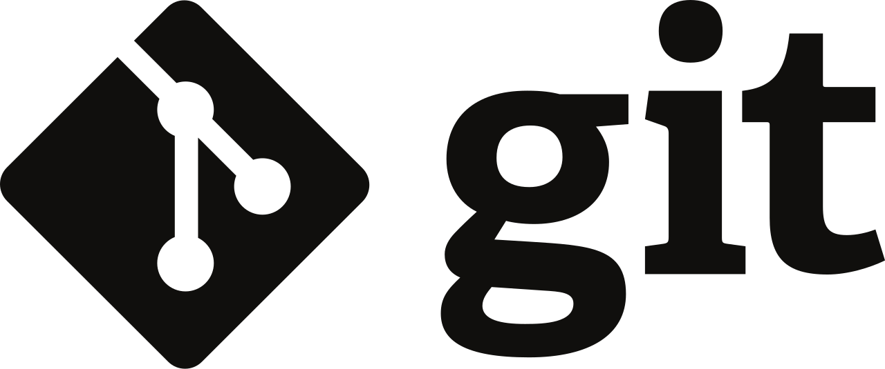

# 基础 Track

基础Track课程，旨在巩固基础，建立全面的专业知识体系。课程涵盖Linux/Git、Python编程、Web开发基础以及数据库与SQL，为后续各 Track 提供系统化的学习，打下坚实的基础。
无论你是计算机专业的学生还是其他领域的学子，这些课程都能为你的学习和科研提供有力支持。掌握计算机最基础的知识，让你在学术和职业生涯中能游刃有余。加入我们，开启编程之旅，让知识成为你前行的动力！

通过基础 Track 的学习，你将能够：

- 掌握 **Linux** 操作系统的基本命令
- 学会 **Git** 的基本操作，了解如何与他人合作开发
- 在已有 C/C++ 编程经验的基础上，快速上手 **Python** 语言，掌握 Python 常用库的使用
- 学习**网络**入门知识，了解网页的构成、当前互联网应用的架构
- 学习**数据库**入门知识，掌握关系型数据库的基本概念和 **SQL** 语句的编写
---

## 🗂 7月15日 现代集成开发环境中的版本管理 —— Linux & Git

>Linux 是一类类 UNIX 操作系统, 具有极高的开放性 (开源免费, 高度可定制), 兼容性 (可以在各种架构的处理器上运行), 稳定性, 安全性, 且拥有强大的开源社区支持, 在嵌入式设备和服务器上有着广泛的应用; Git 是一种分布式版本控制系统, 旨在方便地多人协作进行开发.
>
>在过去的暑培和基础技能培训中, 学长们已经留下了十分清晰详尽的 Linux 和命令行 Git 的使用指南, 作为补充文档和希望大家先修的内容. 本课程将在此基础上, 先提纲挈领地讲解 Linux 的常用命令与 Git 的基本框架, 然后借助 VSCode 与 PyCharm / WebStorm 讲解现代集成开发环境 (IDE) 如何将版本管理集成进项目的工作流程, 如何利用图形化界面简单直观地执行 Git 操作, 尤其是讲解 Merge Conflict 的处理思路与技巧.
>
>在 DSA, ICS 等课程中, 我们将逐渐接触代码量或思维量较大的 "中号" 作业; 在软工等课程中, 我们将进行多人的合作开发. 良好的版本管理和迅速的冲突合并将会为你节省大量的时间 (有时候如果你不会, 你甚至需要把你过去 4h 写的东西全都重写一遍); 也会对你拿到学长的项目后迅速理解项目逻辑, 定位问题, 找学长对线 提供大量帮助.

🎓 讲师：董业恺

### 课前准备
[Linux & Git 课前准备](https://summer24.net9.org/basic/linux_git/Pre-requisite/)

### 课程讲义
[Linux](https://summer24.net9.org/basic/linux_git/Linux/)
[Git](https://summer24.net9.org/basic/linux_git/Git/)

### 课程作业
- 玩玩去年的 [CTF](https://github.com/sast-summer-training-2023/sast2023-linux-git/blob/main/handout.pdf), 3.5 节; 答案在[去年的仓库](https://github.com/sast-summer-training-2023/sast2023-linux-git) 里面

### 课程回放
[课程回放](https://www.bilibili.com/video/BV1bM4m127DE/?share_source=copy_web&vd_source=49053b7356a25d7661b5d45f37afd1fb)

## 🐍 7月16日 Python

> Python 是当前最热门的编程语言之一。它以简单易学、灵活强大的特点著称，广泛应用于数据科学、人工智能、web开发和自动化运维等领域。本课程将带你从零开始，学习 Python 的基础语法和编程技巧，帮助你掌握这门强大的编程语言。
>
>学习 Python 的原因有很多。首先，Python 是许多高级课程和项目开发的基础语言，掌握它可以为后续的学习打下坚实的基础。其次，Python 以其简洁的语法和高效的开发体验而闻名，使编程变得更加直观和愉快。相比于其他编程语言，Python 更容易上手，能够迅速提高你的编程能力和开发效率。最后，虽然现在的大语言模型可以轻松生成一段大差不差的 Python 代码，但要想让它不会跑着跑着就出问题，还是得能至少看懂 Python 代码不是吗？
>
>通过学习本课程，你将能够：
>
> - 熟练使用 Python 进行基础编程，掌握变量、数据类型、控制结构和函数等核心概念。
>
> - 编写简单的脚本和小型程序，实现数据处理和任务自动化。
>
> - 创建和管理虚拟环境，掌握依赖关系的管理，确保开发环境的一致性。
>
> - 这门课程不仅让你掌握 Python 编程的基础，还将为你的编程之路打开新的大门，使你能够在实际项目中发挥 Python 的强大功能，实现自己的创意和目标。

🎓 讲师：宋嘉玺

### 课前准备
[Python 课前准备](https://summer24.net9.org/basic/python/Pre-requisite/)

### 课程讲义
[Python](https://summer24.net9.org/basic/python/handout/)

### 课程作业
[Python 作业](https://summer24.net9.org/basic/python/handout/#_48)

### 课程回放
[课程回放](https://www.bilibili.com/video/BV1Ny411B7Ex/?share_source=copy_web&vd_source=a80492aa87f464b5346dca18c3a9e9b3)

## 🖥 7月18日 Web基础

> World Wide Web (即 Web) 是互联网中使用最广泛的应用。相比于传统的广播或电视仅提供特定的内容，Web 允许用户获取需要的内容。这样按需操作的特点对许多用户都极具吸引力。此外，任何人在 Web 上发布信息都非常简单，人们只需要极低的费用就可以传播信息。
>
> 本课程将会介绍有关 Web 的基础知识，并讲解如何构建一个简单的 Web 应用。我们希望在学习本课程后，大家可以初步了解：1. 当我们在浏览器中输入一个网站时，网页是如何被获取 (并展示给我们)的； 2. 我们看到的网页由哪些元素构成； 3. 互联网应用的架构是怎样的。同时，我们希望大家在学习本课程后具备搭建简单的、可供他人访问的网站的能力。本节课程将为暑培后续的前端、后端课程打下基础，并将与后续的课程一起帮助大家为程序设计训练、软件工程等课程做好准备。

🎓 讲师：董心知

### 课程讲义
[Web 基础](https://summer24.net9.org/basic/Web_basics/Web_basics.pdf)

### 课程作业
[Web 基础 作业](https://summer24.net9.org/basic/Web_basics/hw.pdf)

### 课程回放
[课程回放](https://www.bilibili.com/video/BV1pb421J7cR/?share_source=copy_web&vd_source=a80492aa87f464b5346dca18c3a9e9b3)

## 🏦 7月19日 数据库 & SQL

> 经过一年的学习，同学们应该能够意识到，简单地使用文件直接存储大量数据存在效率低下、数据冗余和管理困难等问题。数据库技术通过结构化存储和高效检索，提供了一种更为可靠和高效的解决方案，确保数据的一致性、完整性和安全性，并已在业界广泛应用。SQL 作为一种强大的数据查询和操作语言，是数据库管理的重要工具，同样需要我们学习。通过本节课，你将了解数据库技术的相关知识及 SQL 的基本语法，初步掌握利用 SQL 进行数据库管理与查询的基本方法。在小学期和软件工程课程中，本节课所学内容也将得以应用。

🎓 讲师：陈奕韬

### 课前准备
[数据库 & SQL](https://summer24.net9.org/basic/sql/Pre-requisite/)

### 课程讲义
[数据库 & SQL](https://summer24.net9.org/basic/sql/handout/)

### 课程回放
[课程回放](https://www.bilibili.com/video/BV1PS42197ve/?share_source=copy_web&vd_source=a80492aa87f464b5346dca18c3a9e9b3)