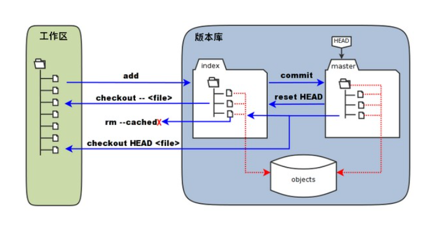
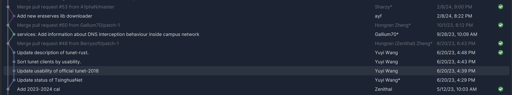
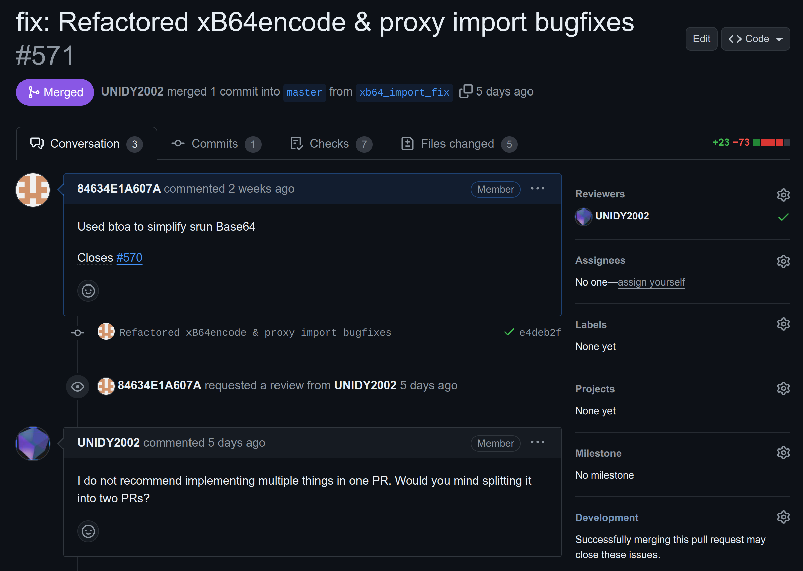

# Git

## Intro

为啥要用 Git? 首先, 你并不一定要用 Git, 或者任何的源码管理系统. 只要你:

- 有足够的 Brain Power, 知道自己在干嘛, 一周前干了啥, 当时为啥要这么干
- 有足够的耐心, 在不小心删掉写了一整天的代码之后重新写一遍
- 有足够的能力, 独立开发, 不需要深入合作; 或者能够接受使用微信 / 邮件互相发代码以同步更改

这些要求显然是很容易达到的 ~~个鬼~~, 但是 Git 为我们提供了更好的解决方案:

- 使用 Git Blame, 你可以查看每一行代码是谁写的, 以及为什么写的
- 使用 Git Log / Git CherryPick, 你可以回滚更改, 也可以将某些更改应用到其他分支
- 使用 Git Branch, 你可以在不同的分支上开发不同的功能, 多人协作, 互不干扰

## 本地仓库

首先我们介绍 Git 的本地仓库结构.

Git 的所有东西都在 `.git` 目录下. 我们一般把 **最新的项目文件和其它资源文件** (也就是 Repo 所在的文件夹除了 `.git` 之外的所有东西) 叫做 **工作区 (Working Directory)**.

在工作区中, 你可以对文件进行增删改查, 但是这些更改并不会被 Git 记录. 为了记录这些更改, 你需要这些更改添加到 **暂存区 (Staging Area)**. 暂存区中的文件会在下一次提交时被记录.

将文件添加到暂存区使用 `git add` 命令; 提交更改到本地仓库使用 `git commit` 命令.

提交之后, 你的 **更改 (Diff)** 会被记录到本地仓库中. 你可以使用 `git diff` 命令查看更改.

## 分支管理

Git 的分支管理是其最大的特色之一. 你可以在不同的分支上开发不同的功能, 互不干扰. 比如:

- `master` 分支是主分支, 用于发布稳定版本
- `dev` 分支是开发分支, 用于开发新功能和测试不太稳定的版本
- 其它分支用于开发特定功能, 比如 `feature-xxx` 分支

假设你在 `a` 分支上开发 A 功能, 你的同事在 `b` 分支上开发 B 功能; 同时你可以在 `fix_c` 分支上修复 C 功能的 Bug. 在理想的情况下, 这三个功能的开发和修复互不干扰, 可以同时进行.

## 远程仓库

除了本地仓库, Git 还支持远程仓库. **远程仓库** 是一个网络上的仓库, 你可以从远程仓库拉取代码, 也可以将本地仓库的更改推送到远程仓库.

远程仓库的地址一般是一个 URL. 使用 `git remote add` 命令添加远程仓库, 使用 `git push` 命令推送更改到远程仓库, 使用 `git pull` 命令拉取远程仓库的更改, 用 `git fetch` 命令获取远程仓库的更改但不合并到本地仓库.

远程仓库的一般访问方式有两种, HTTPS 和 SSH. HTTPS 方式一般会要求输入邮箱和 **Personal Access Token (PAT)**, SSH 方式需要配置 SSH Key (详见 SSH 章节).

## 远程仓库上的 PR 管理

以 Github 为例, 在远程仓库上, 你可以发起 **Pull Request (PR)**, 对 PR 进行评论 / 审查, 最终合并 PR 到 **目标分支**.

PR 有若干合并策略:

- FF-Only: 只允许 Fast-Forward 合并, 也就是说, 目标分支的 HEAD 必须是 PR 分支的祖先.

  

- Merge Commit: 生成一个 Merge Commit, 形成环状结构.

  

- Rebase: 将 PR 分支的更改变基到目标分支上, 然后 Fast-Forward 合并.

  

- Squash: 将 PR 分支的所有更改合并为一个 Commit, 然后 Fast-Forward 合并.

## VSCode 的 Git 支持

VSCode 的 Git 支持由 Git 插件提供; GitLens 插件包含更多的功能 (但是我没怎么用过).

在开启 GitLens 插件之后, 你可以在每行代码的右边看到这一行代码的最近修改者, 最近修改时间, 以及这一行代码的历史. (比如下图就是前面几行的历史). 现在遇到奇怪的 Bug, 你就知道是谁写的啦 (然后就可以去问他, '这么写有什么特殊的意义和考虑嘛?')

## JetBrains IDE 的 Git 支持

JetBrains IDE 原生支持 Git. 这些 IDE 除了贵以外没有什么缺点 (但是你清有免费学生版, 所以不用白不用).

这张图是我们软工大作业后端的开发环境. 左侧的栏目是 Git (VCS) 的版本控制栏目, 可以看到当前暂存区状态等信息; 下面的栏目是 Git 信息, 包括了 Git Remote 和 Branch 信息; Git Log; 选中 Commit 可以看到 Commit 的详细信息. 后端的版本几乎是线性的, 但是软工要求不能直接在 `master` 分支上开发. _(用了什么合并策略?)_

这张图是我们软工前端的 UI 设计 (全都红了是因为这个项目的依赖全都没装). 点击函数右侧的 `Bill +2` 可以呼出 Git Blame, 看到每一行代码的修改历史.

比起后端代码 (几乎全是我写的), 前端代码充分体现了赶 DDL 时候多人 ~~混乱~~ 协作开发的特征: 多条分支并行开发, 多个 PR 同时进行, _(用了什么合并策略?)_, 有条不紊解决了多个 Bug, 完成了项目的收尾工作.

这张图是 JetBrains IDE 的 Diff Viewer. 你可以看到两个 Commit 之间的更改, 以及更改的详细信息. 在翻找 Bug 的可能成因 / 解决 Merge Conflict 时, 这个功能可以说是一把利刃.

## Cherry-Pick: 如何应用在其它分支上的更改

讲这件事的起因是这样的:

不管是软工大作业还是其它的开源项目, 每一个 PR 都期望只包含一个功能的更改. 但是怎么定义 _一个功能_ 就每个人有不同的理解了. 比如我认为这两个功能是关联的, 可以扔一块; 但是另一个人认为这两个功能是独立的, 应该分开.

这时候就可能出现这样的情况, 你需要把一个 Branch 的改动分成两个 Branch 完成 (当然这也常见于软工课三个小时写出来 1500 行一个 PR 但你想 Squash Merge 的时候). 推荐的方法是使用 Cherry-Pick 方法, 把不同类型的 Commit 拆开到不同的 Branch 上面.

在 JetBrains IDE 里面, 这件事情格外简单. 首先我们 Switch 到对应的分支上, 在 Log 里面找到我们想要的 Commit (或里面想要的更改), 右键选择 `Cherry-Pick Selected Changes`, 然后就可以把这个更改应用到当前分支上了. 如果有冲突, 也可以在 Conflict Resolver 里面解决.

## Conflicts: 解决冲突的一般方法

我们在多人协作合并 PR 的时候难免会遇到冲突. 在遇到冲突的时候相信大多数人都会很头疼 (当然我也是), 但是冲突又是不可避免的事情. 当然, 你可以在小群里发, _"这会大家都别写, 我写, 谢谢你们请你们喝奶茶"_, 但是如果是一个 15 人的项目, 这就会显著拖慢项目的进度了.

首先你需要记住一点: **不要盲目合并!!! 不要盲目 Accept Theirs!!! 尤其不要盲目 Accept Yours!!!**

以及, **不要 Force Push!!! 确认线上版本正确后再删本地分支!!!** 不然就会出现这样的情况:

在 Merge 的时候, 基本的策略如下:

- 如果你的更改不多, 可以考虑 `Accept Theirs`, 然后手动添加你的更改

- 如果你确信你的更改会完全覆盖他们的更改 (比如你把某一个函数整个 _删掉_ 了 (注意不是挪了个地方)), 那么可以考虑 `Accept Yours`

- 在大多数情况下, 你需要彻底搞清楚你干了什么, 他们干了什么, 然后手动解决冲突

在 JetBrains IDE 里面, 当出现冲突的时候, Git 栏目里面会显示冲突的文件, 点击 `Resolve` 会进入冲突解决界面.

在这个界面中, **左侧是现有的更改, 右侧是希望合并的更改, 中间是两者的最近共同祖先**, 蓝色和绿色的部分是没有冲突的部分, 红色的部分是出现冲突, 需要手动解决的部分. 你可以选择 `Accept Theirs` (点一下右边的箭头) 或 `Accept Yours` (点左边的) 来解决冲突, 也可以手动修改冲突的部分.

一般来说, 先点一下整个页面左上角的 "Apply All Non-Conflicting Changes" 可以把没有冲突的部分合并掉, 然后再手动解决冲突的部分. **这很重要, 否则只有冲突的部分被解决了, 剩下的全丢了 (x**

然后我们看冲突的部分: 在这个例子中, 我添加了 SM2 算法支持, 而主线上添加了 2FA 支持, 这两个更改相互独立, 但是修改发生在了同一个地方. 因此应该保留两者的更改.

由于我这边的更改不多, 我选择先 `Accept Theirs`, 然后在最终结果中添加我的更改.

全部 Resolve 之后, **务必确认程序按照预期运行**, 然后运行可能的格式更正脚本 / 代码风格检查脚本, 最后再提交.
