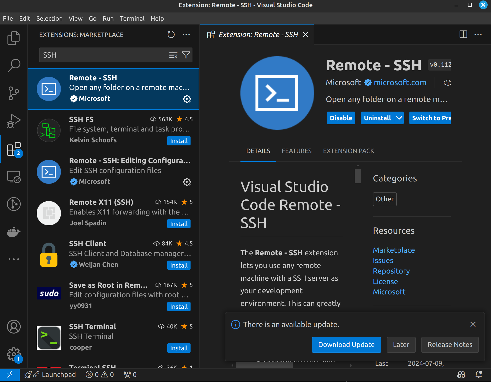

# Linux

## 卷首语

从个人偏好与经验来讲, 我推荐大家直接使用原生的 Linux / Mac 进行开发. 原因如下:

- Windows 上面配环境太见鬼了, 且 Windows 上 WSL2 有些内存问题, 容易消耗大量内存导致系统不稳定. ~~(当然有人跟我杠过, 你杠就是你对)~~
- Linux 可以更好配置网络环境, 同时使用大量的 VPN, 策略路由, proxychains. (当然, 你杠就是你对)
- Linux 装系统快, 系统占用小, 玩坏了不心疼 (x)
- 在本地和服务器上有相似的环境, 省得脑壳疼

Linux 上面的东西很多, 还是那几句话, **记得查 man, 记得查官方文档, 记得问 GPT**.

从我的经验上说:

- 当你不知道一件事应该用什么完成的时候, 问 GPT, 但是问完了别慌着用;
- 当你知道一件事大概应该用什么完成的时候, 查 Manual (或者 tldr), 确定正确;
- 当你知道一件事如何完成的时候, 可以看看社区里面有没有更好的方法.

由于学长已经讲了很多了, 我就先提纲挈领, 把我认为有必要讲的东西简单说说.

## 发行版

狭义上的 "Linux" 其实就是一个内核. 上面由各个社区造了很多轮子, 很多轮子组合在一起产生了很多 _"发行版"_. [DistroWatch](https://distrowatch.com/) 上面有很多发行版的排名, 你可以去看看. Linux 的每一个发行版都有自己的特点, 可以按需取用 (也可以 Distro-Hop).

我知道的一点发行版和特性包括了:

- Ubuntu: 很多人把 Linux 和 Ubuntu 画等号, 应该是因为 Ubuntu 确实比较常见, 名气也不小. 不过我觉得它相貌平平, 兼容性倒确实很好.
- Ubuntu Server: 用于服务器, 没有 GUI, 但是可以选择预装大量的服务端软件.
- Debian: Ubuntu 的上游, 以稳定著称. ~~相当丑.~~ 服务器上用的多些.
- Linux Mint: 我主力使用的发行版, 基于 Ubuntu, 但是更加注重用户体验 (好看).
- Arch Linux: 开发者觉得 "一切决定权留给用户", 安装好之后甚至没有 Desktop Environment, 但是深度可定制, 折腾得好就很好用. 软件包相当新. ~~三天两头爆炸~~
- Manjaro: 基于 Arch, 没有具体了解.
- Fedora: Red Hat 的社区版, 听说是 "几乎所有的开发环境都能一键安装", 很省心的系统.
- Kali Linux: 专用于渗透测试的系统, 预装了大量的渗透测试工具. ~~俗话说, Kali 用得好, 牢饭吃到饱 (什么)~~

## 基本操作

去年的暑培文档讲得相当详细 ~~(并且很多我也不会)~~, 所以在这里就不再赘述了. 你可以参考去年的文档和 [Docs9](https://docs.net9.org/basic/linux/) 来入门与学习.

**记住: `man` 和 `tldr` 是好东西.**

## SSH

我们接下来将直接讨论 Linux 远程使用的最常用手段: SSH. 这在下学期的 ICS 课程中将会用到, 在干乱七八糟事情的时候也总会用到.

### 什么是 SSH

Secure SHell, 是一种用于在不安全网络上 **安全访问远程计算机** 的协议. 它提供了一种加密的方法, 使得用户可以通过不安全的网络连接上安全地 **远程登录 (ssh) 和传输文件 (scp / sftp)**.

SSH 提供了完整的 Linux Shell 支持, 且协议开源可信, 常用终端开源, 安全漏洞较少, 因此被广泛使用.

### SSH 的基本使用方法

`man ssh`:

```text
SYNOPSIS
     ssh [-46AaCfGgKkMNnqsTtVvXxYy] [-B bind_interface] [-b bind_address] [-c cipher_spec] [-D [bind_address:]port] [-E log_file] [-e escape_char] [-F configfile] [-I pkcs11] [-i identity_file] [-J destination] [-L address] [-l login_name] [-m mac_spec]
         [-O ctl_cmd] [-o option] [-p port] [-Q query_option] [-R address] [-S ctl_path] [-W host:port] [-w local_tun[:remote_tun]] destination [command [argument ...]]
```

看着一大坨对吧 (x) 那么看看 tldr 怎么说:

```text
$ tldr ssh
ssh
Secure Shell is a protocol used to securely log onto remote systems.It can be used for logging or executing commands on a remote server.More information: https://man.openbsd.org/ssh.

 - Connect to a remote server:
   ssh {{username}}@{{remote_host}}

 - Connect to a remote server with a specific identity (private key):
   ssh -i {{path/to/key_file}} {{username}}@{{remote_host}}

 - Connect to a remote server using a specific [p]ort:
   ssh {{username}}@{{remote_host}} -p {{2222}}

 - Run a command on a remote server with a [t]ty allocation allowing interaction with the remote command:
   ssh {{username}}@{{remote_host}} -t {{command}} {{command_arguments}}

 - SSH tunneling: [D]ynamic port forwarding (SOCKS proxy on localhost:1080):
   ssh -D {{1080}} {{username}}@{{remote_host}}

 - SSH tunneling: Forward a specific port (localhost:9999 to example.org:80) along with disabling pseudo-[T]ty allocation and executio[N] of remote commands:
   ssh -L {{9999}}:{{example.org}}:{{80}} -N -T {{username}}@{{remote_host}}

 - SSH [J]umping: Connect through a jumphost to a remote server (Multiple jump hops may be specified separated by comma characters):
   ssh -J {{username}}@{{jump_host}} {{username}}@{{remote_host}}

 - Agent forwarding: Forward the authentication information to the remote machine (see man ssh_config for available options):
   ssh -A {{username}}@{{remote_host}}
```

简单地说: 在 80% 的情况下, 你只需要记住 **`ssh username@remote_host`** 即可. 比如: `ssh root@example.com`.

我印象里 ICS 的 SSH 在 2222 端口, 所以你需要 `ssh ics_2023000000@166.111.xxx.xxx -p 2222`.

**需要注意的是:** SSH 的几个应用的端口号设置不尽相同, 还是得稍微记一下.

```sh
ssh -p 2222 root@example.com # OK
ssh root@example.com -p 2222 # OK

scp example.com:~/do.not.exist ./ -p 22222 # Fail
scp example.com:~/do.not.exist ./ -P 22222 # Fail
scp -P 22222 example.com:~/do.not.exist ./ # OK, scp 的端口号是大写 P, 且端口号选项必须在文件名之前

sftp example.com -P 22222 # Fail
sftp -P 22222 example.com # OK, sftp 的端口号也是大写 P, 且端口号选项必须在文件名之前
```

### Pubkey Authentication

现在我们基本解决了 _直接_ 连接问题. 接下来我们讨论一下认证问题.

SSH 的基本认证模式是密码认证. 但是现代 Linux 为了防止密码爆破, 常常使用 Yescrypt 等算法. 如果你开了密码认证且有人想爆破你的密码, 20000 Pwd/s 的速度会耗尽你服务器的计算资源并导致你自己连不上去. (参考, 上个寒假科协的服务器就这样.)

同时, SSH 的密码认证是 **加密信道中传输明文密码**, 如果我有 Root 权限, 我可以给 sshd 挂钩子, 记录你的密码.

为了避免这些问题, 我们推荐使用 Pubkey Authentication.

首先使用 `ssh-keygen` 来生成一个密钥对 (已经干过的可以跳过). 个人推荐 ED25519 算法 (`ssh-keygen -t ed25519`). 用默认方法生成之后, 你会得到两个文件: `~/.ssh/id_ed25519` 和 `~/.ssh/id_ed25519.pub`. 前者是私钥, 后者是公钥.

**_永远不要暴露自己的私钥!!!_**

然后可以使用两种方法将公钥传输到服务器上:

- 使用 `ssh-copy-id` 命令: **`ssh-copy-id -p 2222 root@example.com`**, 注意是 **小写 p**, **放前面**. (为啥每个命令都不一样呢)

- 手动编辑 `~/.ssh/authorized_keys` 文件, 将公钥复制进去. 记得复制全了. 记得这个文件的权限最好是 **600**, 即只有你自己能读写 (`chmod 600 ~/.ssh/authorized_keys`).

### SSH with Proxy / Jumping

实际上我们经常遇到需要通过代理 / 多级连接才能连接到目标服务器的情况. 这时候我们可以使用 SSH 的 Proxy / Jumping 功能.

当需要通过代理连接时, 我们一般使用 `ProxyCommand` 选项. 例如:

```sh
ssh -o ProxyCommand="nc -X 5 -x 59.66.xxx.xxx:49274 %h %p" ajax@192.168.1.2
```

这表示我们期望通过 _(`-x`)_ `59.66.xxx.xxx:49274` 的 Socks5 _(`-X 5`)_ 代理连接到 `192.168.1.2` 的 `ajax` 用户. 具体的设置参考 `man nc` (`apt install netcat`)

当拥有各级服务器的权限时, 可以使用 Jumping 功能. 例如:

```sh
ssh -J ajax@59.66.xxx.xxx ajax@192.168.1.2
```

需要注意的是, `man ssh` 中这样写到:

> Note that configuration directives supplied on the command-line generally apply to the destination host and not any specified jump hosts.  Use ~/.ssh/config to specify configuration for jump hosts.

即中间跳板的配置需要在 `~/.ssh/config` 中给出.

### SSH Tunneling

远程开发常常会遇到需要做端口映射的情况. 这时候我们可以使用 SSH Tunneling 功能. 考虑以下场景:

- 你想以服务器的身份 (IP) 访问内网网页:

  ```sh
  ssh -D 1080 your_ssh_host
  ```

  这会在 `localhost:1080` 开放一个 Socks5 代理服务器, 可以设置系统代理 / 浏览器代理到这个端口, 这样你的浏览器就会以服务器的身份访问网页.

<br />

- 你想访问远程的 Django 网站:

  ```sh
  ssh -L 9000:localhost:8000 your_ssh_host
  ```

  这会把远程服务器看来的 `localhost:8000` 映射到本地的 `(localhost:)9000`, 你可以直接访问本地的 `localhost:9000` 来访问远程的 Django 网站. 也可以 `-L 0.0.0.0:9000:localhost:8000` 来让其他人访问 **(这可能很危险, 慎重!)**.

<br />

- 你想让远程服务器访问你的本地服务:

  ```sh
  ssh -R 9000:localhost:8000 your_ssh_host
  ```

  这会把本地的 `localhost:8000` 映射到远程的 `(localhost:)9000`, 这时远程服务器访问 `localhost:8000` 会访问到本地的服务.

常用的 SSH 命令就这么些, 在连接一些古老设备 / 嵌入式设备时, 你可能遇到各种报错. 把报错复制粘贴到 Google 里面就能得到解决方案.

## Task

在登录之后, 一切都像本地一样. 唯一的问题是: 当我需要在服务器上面跑一些东西, 又不想一直挂着在线, 怎么办? 当我网络不太稳定, 怎么保证跑的程序不会因为我掉线而停止? 如果我希望并发开两个程序, 我一定要再开一个 ssh 嘛?

### Job Management

现代的 Shell 都有 Job 管理的功能: Shell 可以有最多一个前台任务和多个后台任务. 键盘 (stdin) 只能与前台任务交互, 但是所有的任务共享屏幕输出 (stdout).

- 你可以在命令后面加上 `&` 来让命令在后台运行:

  ```sh
  ping google.com &
  ```

  然后你的屏幕上就会被一大坨 `ping` 的输出刷屏了 (大雾)

- 你可以对前台任务使用 `Ctrl + Z` 来暂停任务, 然后使用 `bg` 命令将任务放到后台; 也可以使用 `fg %t` 命令将任务 t 放到前台:

  ```sh
  $ ping google.com
  PING google.com (142.251.220.110) 56(84) bytes of data.
  64 bytes from hkg07s52-in-f14.1e100.net (142.251.220.110): icmp_seq=1 ttl=53 time=38.9 ms
  64 bytes from hkg07s52-in-f14.1e100.net (142.251.220.110): icmp_seq=2 ttl=53 time=39.2 ms
  64 bytes from hkg07s52-in-f14.1e100.net (142.251.220.110): icmp_seq=3 ttl=53 time=39.2 ms
  # Ctrl + Z
  fish: Job 1, 'ping google.com' has stopped
  $ bg %1
  Send job 1 “ping google.com” to background
  $ 64 bytes from hkg07s52-in-f14.1e100.net (142.251.220.110): icmp_seq=4 ttl=53 time=38.9 ms # 这里可以看到 ping 继续运行
  64 bytes from hkg07s52-in-f14.1e100.net (142.251.220.110): icmp_seq=5 ttl=53 time=38.7 ms
  64 bytes from hkg07s52-in-f14.1e100.net (142.251.220.110): icmp_seq=6 ttl=53 time=39.1 ms
  fg %1
  Send job 1, “ping google.com” to foreground
  64 bytes from hkg07s52-in-f14.1e100.net (142.251.220.110): icmp_seq=8 ttl=53 time=39.3 ms
  # Ctrl + C
  --- google.com ping statistics ---
  8 packets transmitted, 8 received, 0% packet loss, time 9641ms
  rtt min/avg/max/mdev = 38.700/39.040/39.260/0.183 ms
  ```

- 你可以使用 `jobs` 命令查看当前的任务:

  ```sh
  $ jobs
  Job     Group   CPU     State   Command
  1       2343736 0%      stopped vim /
  ```

需要注意的是, 某些任务可能不能使用 `Ctrl + Z` 暂停, 会出现不可预料的问题; 某些任务无法使用 `bg` 命令放到后台, 如 vim.

```sh
$ bg %1
Send job 1 “vim /” to background
$ fish: Job 1, 'vim /' has stopped
```

### SIGHUP

当你退出 SSH 时, 你的 Shell 会收到一个 SIGHUP 信号. Shell 将此信号传递给所有子进程, 通知它们父进程已经退出, 并且它们应该退出. (于是跑了两个小时的程序就没啦~) 此时有两种解决方法:

- 使用 `nohup` 命令. (这要求你在开始程序之前就想好) `man nohup`.
- 使用 `disown` 命令. (这要求当前程序能正常暂停并放在后台) `man disown`

### Terminal Multiplexer

虽然前面的 Job 管理很好, 但是还是不太好. 比如: 你没法再次 Attach 到 nohup 的任务上, 没法 interactive 地输入输出等.

因此, 在此隆重推出 `tmux` 和 `screen` 这两个 Terminal Multiplexer. 它们可以让你在一个 SSH 连接上开多个 Terminal, 并且可以在断开连接后重新 Attach 到之前的 Terminal 上.

这两个工具的想法比较类似: 它有多个已经 Detach 的 `Session`; 每个 `Session` 可以有多个 `Window`; 每个 `Window` 可以有多个 `Pane`.

我用 Tmux 比较多, 因此这里只讲 Tmux (具体请 `man tmux`).

- `tmux new -s session_name`: 新建一个名为 `session_name` 的 Session.
- `tmux attach -t session_name`: Attach 到名为 `session_name` 的 Session.

在 Session 中:

- `Ctrl + B, C`: 新建一个 Window, 不过我不太用.
- `Ctrl + B, 1-9`: 切换到 Window 1-9.
- `Ctrl + B, D`: Detach 当前 Session.
- `Ctrl + B, %`: 横向分割当前 Pane.
- `Ctrl + B, "`: 纵向分割当前 Pane.
- `Ctrl + B, ArrowKey`: 切换 Pane.
- `Ctrl + B, Ctrl + ArrowKey`: 调整 Pane 大小.

...

建议 **开 SSH 就开一个 tmux**, 这样就免去了大量掉线烦恼.

## VSCode SSH

大家用的最多的远程开发工具应该是 VSCode 的 SSH 插件. 这个插件可以让你在本地 VSCode 中编辑远程服务器上的文件.

### 安装 VSCode SSH



我印象里默认是装好的?

### 打开 VSCode SSH

左下角的 `Open a Remote Window` 点一下, 选 `Connect to Host...`. **推荐使用公钥登录, 不然你会不停输密码.**

然后输进去 `[user@]host[:port]` (**推荐写 SSH Config**)

如果需要多级跳板 / 代理, 请使用 SSH Config.

VSCode 会配置自动端口映射, 也可以在 `PORTS` 选项手动配置.
