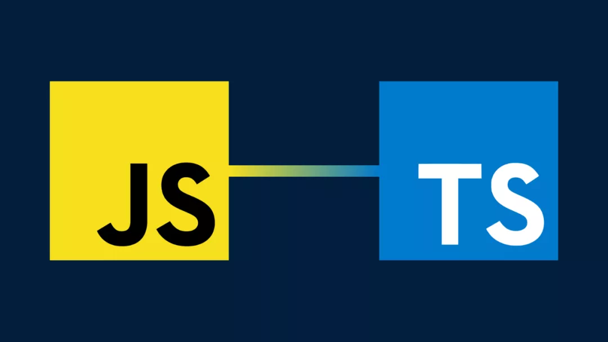

# 前端 Track

开发网站？开发 APP ？如果你对前端开发感兴趣，想要深入了解并掌握更多前端技术。前端Track课程为你提供全面的学习内容，包括Java编程、JSTS、React框架以及Android开发。无论你是想提升技能的初学者，还是希望深入研究的进阶者，这些课程都将为你提供宝贵的知识和实践机会，从零开始一步步开发出属于自己的产品。

通过前端Track课程，你将学会如何构建现代Web应用，掌握移动应用开发的核心技术，实现优秀的美观设计，打造出色的用户体验。快来开启你的前端开发之旅，让你的创意变为现实，在技术的世界中畅游！

通过前端 Track 的学习，你将能够：

- 了解 **Java** 语言的设计思想与基本语法
- 在基础技能培训的 HTML/CSS 基础上，学习 **JavaScript** 语言以及相关前端知识
- 尝试将 **TypeScript** 作为更好的开发语言选择
- 学会使用 **React** 前端框架开发 Web 应用，学会使用组件库快速开发美观的前端
- 在掌握 Java 语法的基础上，学会 **Android** 应用的开发，获得多端开发的能力

---

## 🛠 7月21日 & 7月24日 JSTS

讲师：黄舒翮

### 课前准备
[JSTS 课前准备](https://summer24.net9.org/frontend/JSTS/Pre-requisite/)

### 课程讲义
[JSTS](https://summer24.net9.org/frontend/JSTS/handout/)

### 课程作业

### 课程回放
[JSTS(1) 课程回放](https://www.bilibili.com/video/BV1R4421U7Sn/?share_source=copy_web&vd_source=5f41358f46c6dc60e03c3ff6ca5a8520)