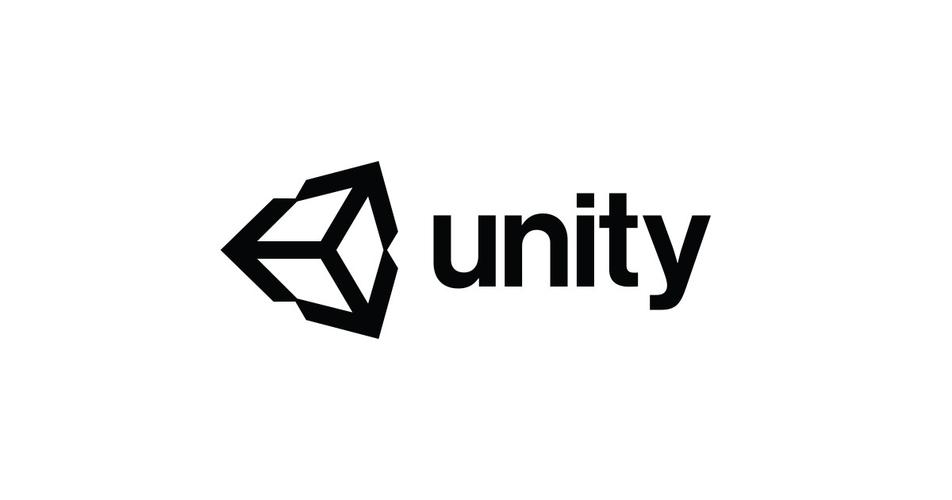

# 游戏 Track

在 B 站上看到各路大神手搓 <del>Bug</del> 各种小游戏？想知道各种 3A 大作是如何诞生的？今年推出的游戏板块将带给你新奇而有趣的体验！无论是对未来虚拟现实技术课程的学习，还是你的游戏开发之路，我们的课程都将提供一个很好的起点。

通过游戏 Track 的学习，你将能够：

- 体验**游戏开发**的**全流程**
- 掌握 **Unity** 的基础概念、坐标系统与材质、动画、C# 脚本等内容

---

>Unity 游戏引擎是一款强大且广泛使用的跨平台游戏开发工具，用于创建高质量的游戏和交互性应用程序。Unity支持多个平台，包括Windows、Mac、iOS、Android等，使开发者能够轻松发布游戏到各种设备上。
>
>在本系列课程中，你将学习Unity的基础概念、项目组成结构与管理、C#脚本基础、动画状态机与VFX素材应用、UI与材质管理等内容。
>
>通过学习该系列课程，你能够体验游戏开发的全流程，在我们提供的demo基础上完成一个完整的基于Unity引擎的3D游戏。

## 🎮 8月2日 Unity 入门

🎓 讲师：俞鹤扬